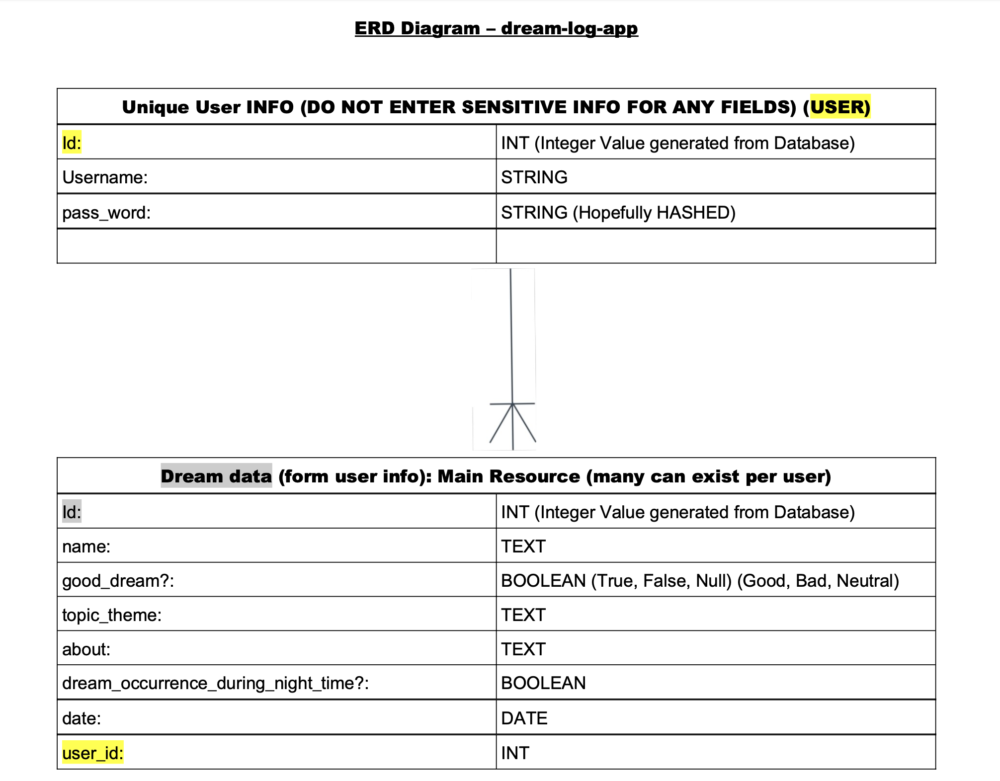

# Dream Log APP #

## INTRODUCTION ##

August Kekulé figured out the chemical configuration structure of Benzene. He notably says that he came about this discovery through a dream he had of a snake biting its own tail. August Kekulé, the scientist responsible for this contribution to field of organic chemistry has been proven to be correct today through various spectroscopic techniques.
Everyone has dreams! This application is a digital journal built to keep track of the dreams that you had while sleeping! In the section about Good dreams, bad dreams, or neutral dreams, it is totally up to User discretion to determine whether their dream was good or bad or neutral. An example of a good dream could be you wake up feeling happy and hopeful. An example of a bad dream could be waking up in a state of terror. A neutral dream could be something you dreamed about that happened in the previous day.

## USER STORY ##

### NOT LOGGED IN ###
As a User, I will be able to visit the homepage of the application, and see information about the Application and the Developer behind it
As a User, I see an initial Navigation bar at the top of the page, which I can click links that take me to various parts of the application, such as the Login PAGE, the Sign Up PAGE, and the Home PAGE.
As a User, once I create a USER entity (username and password), I can LOGIN (be authenticated).

### LOGGED IN ###

As a User, only once Logged in, I can see new Navigation Bar Items added, such as New Form PAGE, and Index PAGE (list of all dreams that were logged).
As a User, only once Logged in, I can create new individual dream from the New Form PAGE.
       
As a User, I can go back to the Index page if I click the back button on the NEW FORM page, cancelling the current dream data log.
As a User, only once Logged in, I can see new all dreams from the Index PAGE.
As a User, only once Logged in, I can click on an individual dream from the Index PAGE, and get to a Show
PAGE of that specific dream.
As a User, only once Logged in, I can edit a specific dream on the Edit FORM PAGE to change mistakes in spelling, category, etc, only once I click on the edit button on the specific dream on the Show page.
As a User, I can go back to the Index page if I click the back button on the Show page.
As as an authenticated USER, I can logout, and see my information no longer viewable to the public.

<!-- npm install cors dotenv nodemon pg pg-promise
passport JS setup for NODESJS EXPRES AND POSTGRESQL
https://www.makeuseof.com/passport-authenticate-node-postgres/

INSTALL THESE AFTER SETUP Helper.js files
npm install bcryptjs

npm install passport
npm install passport-local

The data types in PostgreSQL represent the type of data that a column in a table can hold. Each data type has specific rules and behaviors associated with it. Here's a brief explanation of each data type:
INT, SMALLINT, BIGINT: These data types represent integer values, with INT being the standard 32-bit integer, SMALLINT being a 16-bit integer, and BIGINT being a 64-bit integer.
DECIMAL, NUMERIC: These data types represent fixed-point decimal values, with a specified precision and scale. DECIMAL and NUMERIC are equivalent and interchangeable.
VARCHAR(n), CHAR(n), TEXT: These data types represent character strings, with VARCHAR(n) and CHAR(n) being variable-length and fixed-length strings, respectively, and n being the maximum length of the string. TEXT is a variable-length string without a maximum length specified.
BYTEA: This data type represents binary data, such as images or documents.
DATE, TIMESTAMP, TIMESTAMPTZ, TIME, TIMETZ: These data types represent date and time values. DATE represents a date without a time, TIMESTAMP represents a date and time without a time zone, TIMESTAMPTZ represents a date and time with a time zone, TIME represents a time without a date, and TIMETZ represents a time with a time zone.
BOOLEAN: This data type represents a true/false value.
ENUM: This data type represents an enumerated type, a user-defined data type that consists of a static, ordered set of values.
BIT(n), BIT VARYING(n): These data types represent bit strings, with BIT(n) being a fixed-length bit string, and BIT VARYING(n) being a variable-length bit string. n represents the maximum number of bits.
INET, CIDR, MACADDR: These data types represent network addresses, with INET representing an IPv4 or IPv6 host address, CIDR representing a network address with a specified prefix length, and MACADDR representing a MAC address.
UUID: This data type represents universally unique identifiers, used as primary keys in database tables to ensure uniqueness across multiple systems.
These are the basic data types in PostgreSQL, and there are many others available as well. Choosing the correct data type for each column is important for ensuring data integrity and making the most efficient use of storage. -->